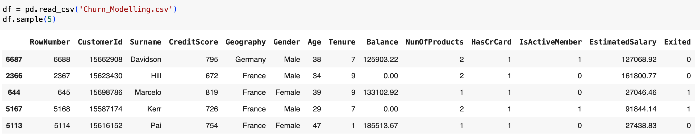
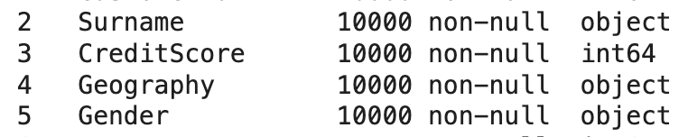
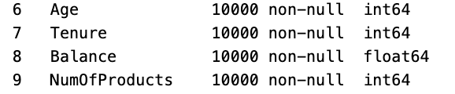

# Этап 1. Описание данных

**Таблица:** данные содержат сведения о клиентах банка, целевая переменная представляет собой бинарную переменную, отражающую тот факт, покинул ли клиент банк (закрыл свой счет) или продолжает оставаться клиентом.

* Таблица содержит `10000 строк` и `14 колонок`;
* Первые две колонки не несут полезной информации, в дальнейшем будут удалены.

---

**Выполнил:** *Никитюк Михаил*
* Переменные *Surname*, *CreditScore*, *Geography*, *Gender*

При открытии таблицы с помощью метода `df.info()` можно получить следующую информацию:

* `Surname` - фамилия клиента, пропуски - отсутствуют, тип данных - категориальная номинальная переменная (object);
* `CreditScore` - кредитный рейтинг клиента (от 350 до 850 ед.), пропуски - отсутствуют, тип данных - числовая непрерывная переменная (int);
* `Geography` - страна проживания клиента (France, Spain, Germany), пропуски - отсутствуют, тип данных - категориальная номинальная переменная (object);
* `Gender` - пол клиента (Female, Male), пропуски - отсутствуют, тип данных - категориальная бинарная переменная (object)

**Выполнила:** *Петрова Арина*
* Переменные *Age*, *Tenure*, *Balance*, *NumOfProducts*

При открытии таблицы с помощью метода `df.info()` можно получить следующую информацию:

* `Age` - возраст клиента в годах (от 18 до 92), пропуски - отсутствуют, тип данных - числовая дискретная переменная (int);
* `Tenure` - количество лет (от 0 до 10), в течение которых клиент пользуется банком, пропуски - отсуствтуют, тип данных - числовая дискретная переменная (int);
* `Balance` - банковский баланс клиента, пропуски - отсуствтуют, тип данных - числовая непрерывная переменная (float);
* `NumOfProducts` - количество банковских продуктов (от 1 до 4), которыми пользуется клиент, пропуски - отсуствуют, тип данных - числовая дискретная переменная (int);